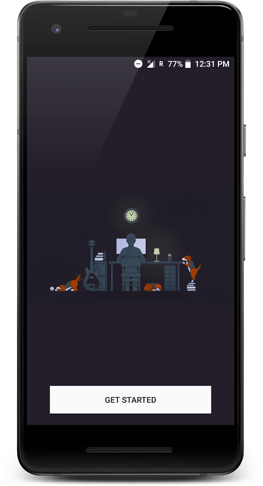

# CollegeSearch

## Description

CollegeSearch is a android application made for making college search easy. This application allows user to search list of colleges in particular state of India providing particular course. The application uses various college search engine available in market.
Firebase is used to store query url of differrent college search engines.

## How It Works??
   
 App asks users to select state, course and search engine in each different activity. After building query app retrieve data from
 Firebase real-time database with the matching query and shows results in Web View.
 Currently only 4 college search engines are integrated with application.

## Tools/Libraries Used
  
  * Android Studio
  * Firebase 
  * Butter Knife 
  * FirebaseUI   
  * Picasso
  
## Want To Contribute??
    
  #### If you want to contibute in this project follow following steps:
       
       1. Clone or Download the repository. Don't forget to give the *.
       2. Use Android Studio version greater than 3.0 and latest gradle version.
       3. Now Log in your google account and open firebase official website https://firebase.google.com/. 
       4. Click Add Project and enter package name of project here this is the package name     "com.example.shubhamr.collegesearch".
       5. google-services.json file will be downloaded when you press add app button.
       6. Paste the google-services.json file to your project’s app folder. This step is very important as your project won’t build without this file.
       7. Now open real-time database option in you Firebase project console and on top-right side click on import JSON.
       8. select the firebaseJSON.json file included in the respository.
       9. Now make changes according to your choice. Don;t upload that google-service.json file in any public repository.
       10. Done.....!
  
   
## Acknowledgement

  > [CareerIndia](https://www.careerindia.com)  
  > [CollegeDunia](https://collegedunia.com)
  > [CollegeSearch](https://www.collegesearch.in)
  > [Shiksha](https://www.shiksha.com)
  > [Background Image](https://wall.alphacoders.com/big.php?i=480421)
  > [FreePik](https://www.freepik.com/)
 
           

 
