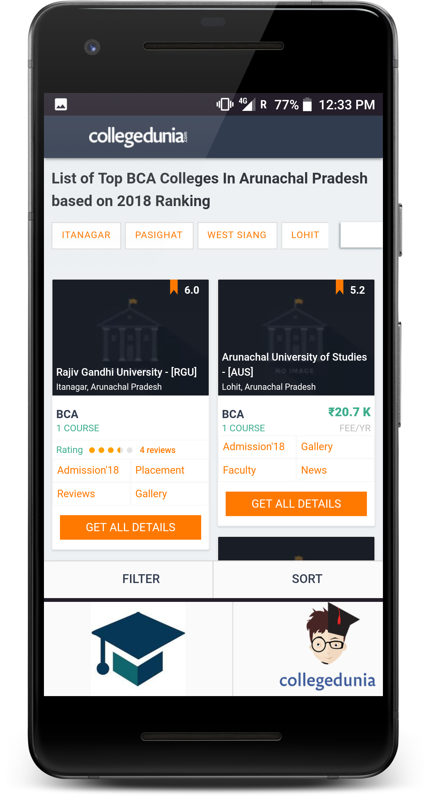

# CollegeSearch

CollegeSearch is a android application made for making college search easy. This application allows user to do all search for
colleges in India in one place without doing hours of searches in google. It uses Firebase for storing query url.

## How It Works??

## Tools/Technology Used
  
  * Android Studio
  * Firebase 
    
## External Libraries Used
   
  * Butter Knife : http://jakewharton.github.io/butterknife/
  * FirebaseUI : https://github.com/firebase/FirebaseUI-Android
  * Picasso : square.github.io/picasso/
   
## References

  1. [CareerIndia](https://www.careerindia.com) 
  2. [CollegeDunia](https://collegedunia.com)
  3. [CollegeSearch](https://www.collegesearch.in)
  4. [Shiksha](https://www.shiksha.com)
  5. [Background Image](https://wall.alphacoders.com/big.php?i=480421)
 
           

