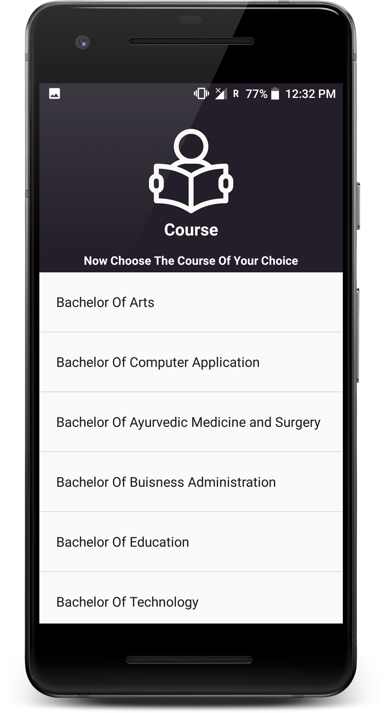

# CollegeSearch

## Description

CollegeSearch is a android application made for making college search easy. This application allows user to do all search for
colleges in India in one place without doing hours of searches in google. It uses Firebase for storing query url.

## How It Works??
   App asks users to select state, course and search engine in each different activity. After building query app retrieve data from
   Firebase database with the matching query and shows result in Web View.
   Currently only 4 college search engines are integrated with application.

## Tools/Libraries Used
  
  * Android Studio
  * Firebase 
  * Butter Knife 
  * FirebaseUI   
  * Picasso
  
   
## Acknowledgement

  1. [CareerIndia](https://www.careerindia.com) 
  2. [CollegeDunia](https://collegedunia.com)
  3. [CollegeSearch](https://www.collegesearch.in)
  4. [Shiksha](https://www.shiksha.com)
  5. [Background Image](https://wall.alphacoders.com/big.php?i=480421)
  6. [FreePik](https://www.freepik.com/)
 
           

 
